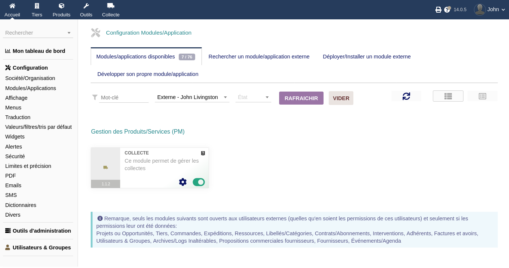
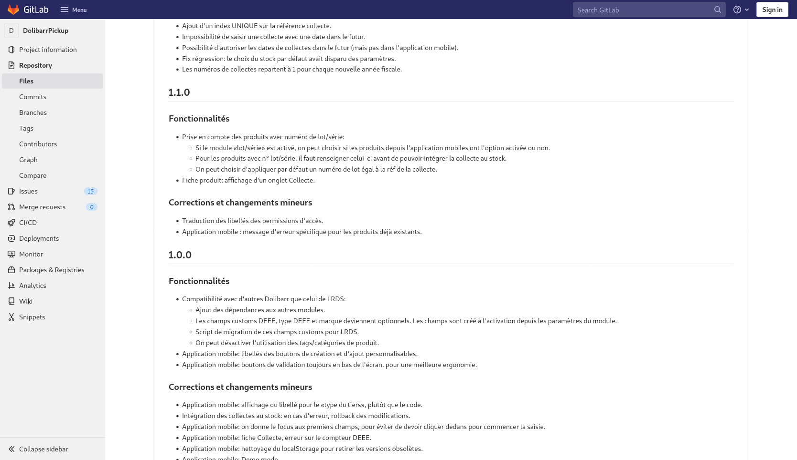
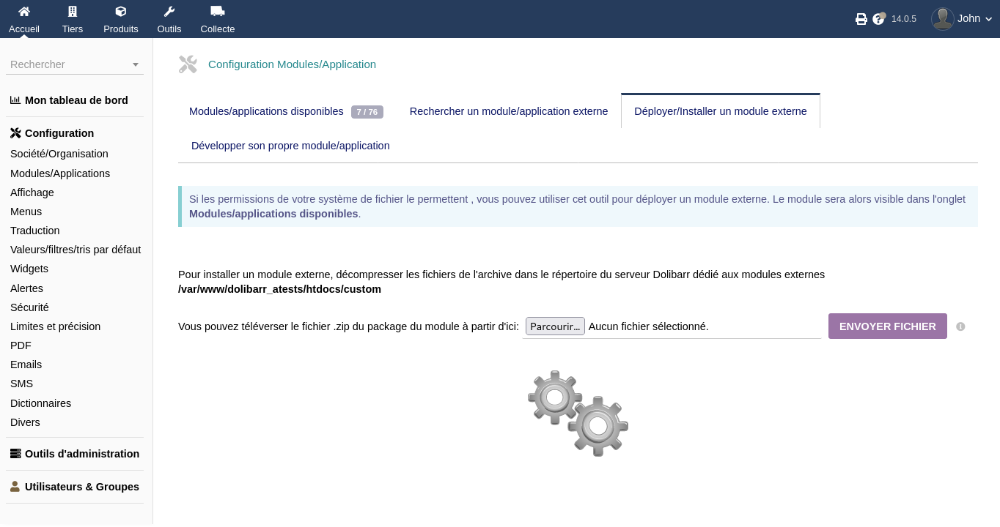

+++
title="Mise à jour"
chapter=false
weight=30
+++

{}
Pour l'instant il n'y a pas encore de moyen d'être prévenu automatiquement de l'arrivée de nouvelles versions.
Il est probable qu'une mailing-list soit créé très prochainement.
{}

## Vérifiez les mises à jours disponibles

Avant toute mise à jour, il faut vérifier la version qui est actuellement utilisée sur votre Dolibarr.
Celle-ci est affichée sous l'icone du module (ici il s'agit de la «1.1.2») :

Ensuite, aller voir le fichier «Changelog» (journaux des modifications) sur l'un des liens ci-dessous :

- [Gitlab Globenet](https://code.globenet.org/john/DolibarrPickup/-/blob/main/ChangeLog.md)
- [Github](https://github.com/JohnXLivingston/DolibarrPickup/blob/main/ChangeLog.md)

Ce fichier liste pour chaque numéro de version les modifications qui ont été effectuées.

{}
Parcourez ce fichier en remontant de votre version actuelle jusqu'à la version que vous comptez installer.
Vérifiez qu'il n'y a pas de section **«Remarques importantes»** qui indiqueraient **d'éventuelles incompatibilités**
ou une **procédure de mise à jour** spécifique à suivre.
{}

Une fois que vous avez-pris connaissance d'éventuelles instructions spécifiques, vous pouvez aller télécharger
la version du module qui vous intéresse, via la même procédure qu'indiquer dans le [guide d'installation](../install/),
c'est à dire en téléchargeant l'archive depuis l'un des liens suivants :

- [Gitlab Globenet](https://code.globenet.org/john/DolibarrPickup/-/tree/main/build)
- [Github](https://github.com/JohnXLivingston/DolibarrPickup/tree/main/build)

## Installer la nouvelle version du module

Suivez-la même procédure que pour la première [installation](../install/) :
rendez-vous sur la page **«Accueil > Configuration > Modules/Applications»** de votre Dolibarr,
puis dans l'onglet **«Déployer/Installer un module externe»**, et envoyez le fichier :

| | |
|---|---|
|  | 

{}
Il vous faut ensuite désactiver puis réactiver le module.
C'est la procédure habituelle dans Dolibarr pour que les modules puissent appliquer leurs changements de structure.
{}
