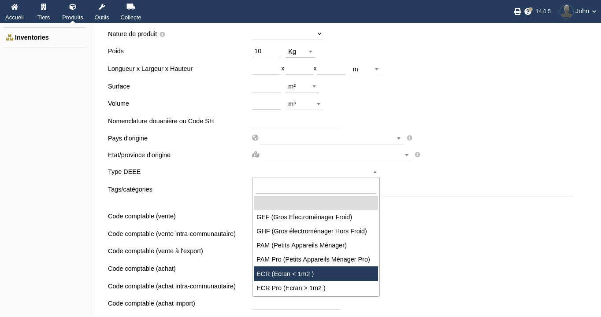
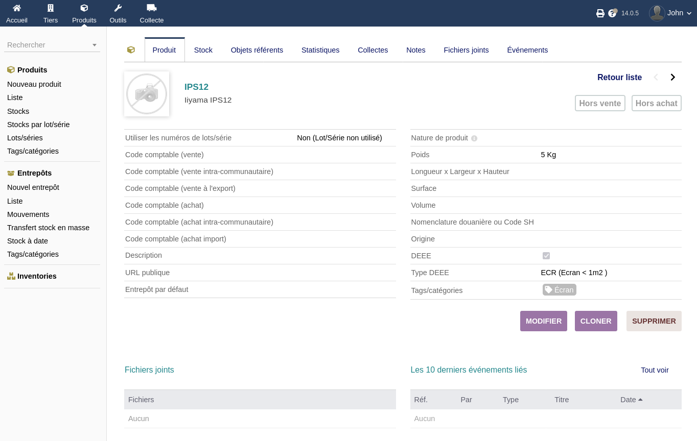
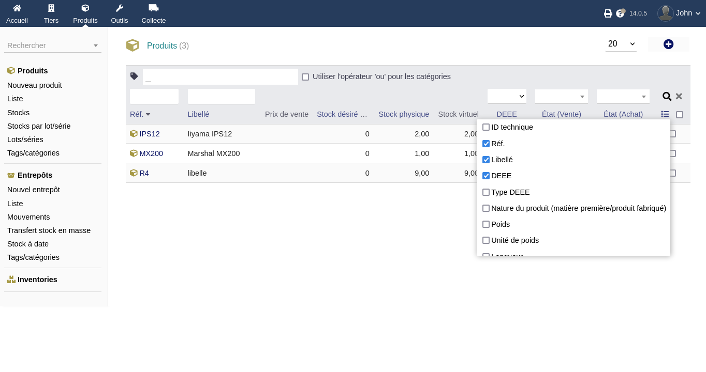

+++
title = "DEEE"
weight = 80
chapter = false
+++

Le module collecte est capable de gérer les DEEE (Déchets d’équipements électriques et électroniques).

{}
Si vous n'êtes pas concerné par les DEEE, il est tout à fait possible de les désactiver.
{}

## Sur la fiche produit

Un champs «Type DEEE» est automatiquement ajouté aux formulaire des fiches produits, permettant de préciser à quelle catégorie de déchet le produit appartient.

Dans la fiche en mode lecture, ce champs est complété d'une case à cochée «DEEE» calculé automatiquement.

Dans les listes de produits, les colonnes «DEEE» et «Type DEEE» sont ajoutées (on peut choisir de les afficher/masquer).

