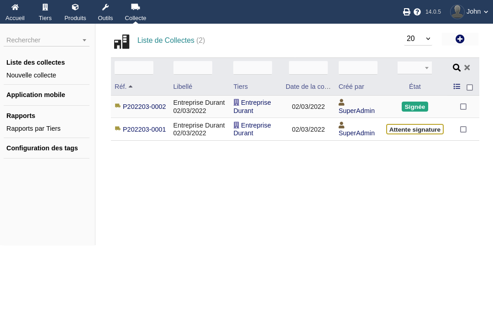
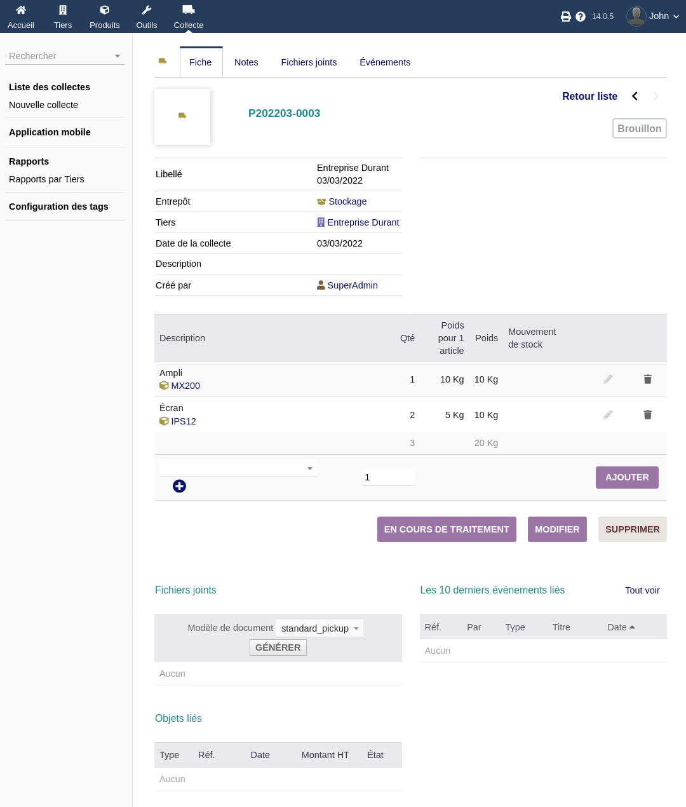
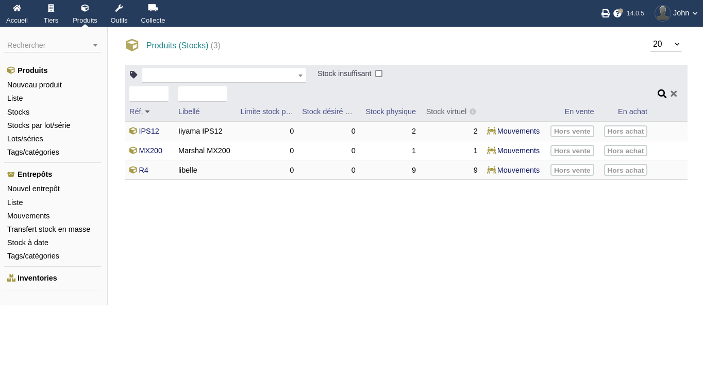
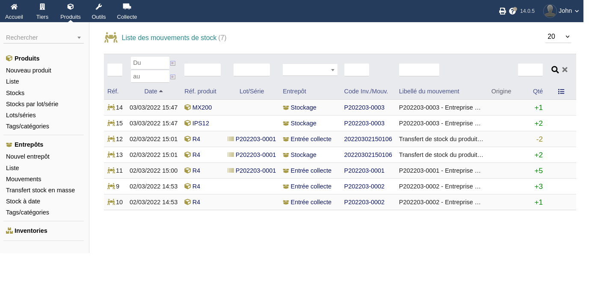
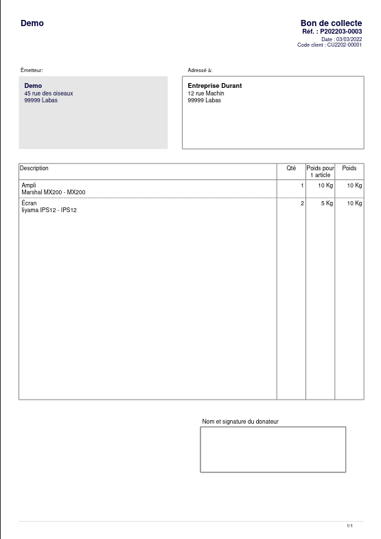

+++
title = "Les collectes"
weight = 5
chapter = false
+++

## Fiche collecte

Chaque collecte de matériel ou matériaux chez un tiers (appelé «Donneur» dans l'application) donne lieu à la saisie d'une fiche de collecte.

|  |  |
| ------ | ----------- |
|  |  |

La fiche de collecte permet de renseigner les éléments suivants:

- date de la collecte
- tiers ayant donné les matériaux/matériels
- le stock dans lequel intégrer les produits de cette collecte
- liste des matériaux/matériels donnés, leurs quantités, leur poids, ...

## Status

La fiche de collecte passe par plusieurs statuts.

Chacun de ces statuts est accompagné de droits associés, permettant ainsi de définir avec précision quels utilisateur⋅rice⋅s ou groupes d'utilisateur⋅rice⋅s peuvent intervernir, et à quelles étapes.

### Brouillon

À ce stade on peut ajouter des produits, modifier leurs quantités, poids, ...

### En cours de traitement

Ici il n'est plus possible de modifier le contenu de la collecte, uniquement ses méta-données.
Il est possible de revenir au statut Brouillon si nécessaire.

### En attente de signature

À partir du moment où l'on passe dans cet état, les produits récoltés sont intégrés au module de Stock de Dolibarr.
Les mouvements de stocks associés sont créés.

|  |  |
| ------ | ----------- |
|  | 

Il n'est plus possible de revenir en arrière.

Un bon de collecte au format PDF est généré.

### Signée

Le tiers a signé le bon de collecte, le cycle de celle-ci est donc terminé.
